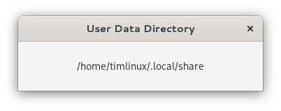

Simple Rust program to print your current gnome path.

This programme was written for the most part by ChatGPT!


I created the initial project like this:

```
cargo new gnome-path-printer
```

To build:

```
nix-shell
cargo build
```

To run:

```
target/debug/gnome-path-printer
```

Example output:

```
User data directory: "/home/timlinux/.local/share"
```

Updated now to be a little Gnome app:



Tim Sutton
2024
